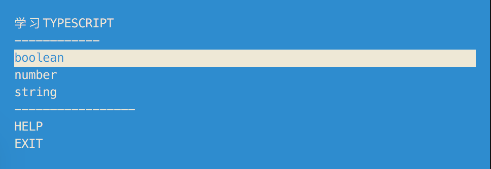
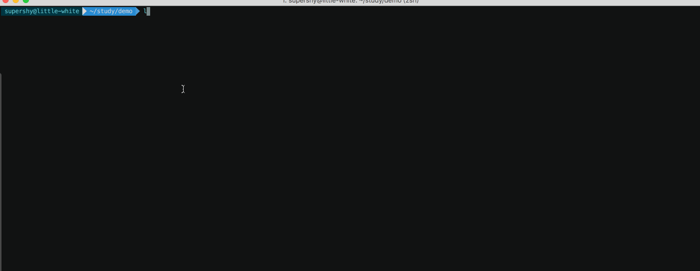

# LEARNTYPESCRIPT

> 通过adventure来学习typescript

> 本文关于typescript的讲解内容来自于[《TypeScript 入门教程》](https://ts.xcatliu.com/)

> 更多的教程请查看[*nodeschool.io.*](https://nodeschool.io/)

### 安装

```shell
npm install -g learntypescript
npm install -g typescript
```

### 运行

```shell
learntypescript
```

将会看到以下菜单：



通过上下键来选择不同的教程，教程完成后会有completed状态

### demo



### 帮助

* 验证代码

  ```shell
  learntypescript verify xxx.xx
  ```

* 查看解决方案

  ```shell
  learntypescript solution
  ```

* 重置（会把completed状态重置）

  ```shell
  learntypescript reset
  ```